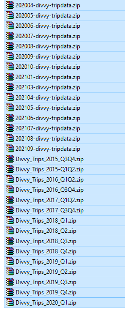

# Case Study

Hi, this is Ahmed from Berlin 👋


Personally, I work as a freelancer developer on Upwork and spent the last 5 years of my life playing with Microsoft Excel and VBA ✌

Currently I am looking forward to work as a marketing data analyst and I got into this course as I have a huge interest in the Marketing industry. 

This is a case study for the 8th course in Google Specialization on Data analytics 

[Google Data Analytics Capstone: Complete a Case Study](https://www.coursera.org/learn/google-data-analytics-capstone)

Find me on [Twitter](https://twitter.com/Ahmedika9) 

Or [Upwork](https://www.upwork.com/freelancers/~01cbe983acae2276d2?s=1110580753207906304)

## Case Study: How Does a Bike-Share Navigate Speedy Success?

### Task description by Google:

### Scenario

You are a junior data analyst working in the marketing analyst team at Cyclistic, a bike-share company in Chicago. The **director of marketing** believes the company’s future success depends on **maximizing the number of annual memberships**. Therefore, your team wants to understand how casual riders and annual members use Cyclistic bikes differently. From these insights, your team will design a new marketing strategy to convert casual riders into annual members. But first, Cyclistic executives must approve your recommendations, so they must be backed up with compelling data insights and professional data visualizations.

### Characters and teams

- **Cyclistic**: A bike-share program that features more than 5,800 bicycles and 600 docking stations. Cyclistic sets itself apart by also offering reclining bikes, hand tricycles, and cargo bikes, making bike-share more inclusive to people with disabilities and riders who can’t use a standard two-wheeled bike. The majority of riders opt for traditional bikes; about 8% of riders use the assistive options. Cyclistic users are more likely to ride for leisure, but about 30% use them to commute to work each day.
- **Lily Moreno**: The director of marketing and your manager. Moreno is responsible for the development of campaigns and initiatives to promote the bike-share program. These may include email, social media, and other channels.
- **Cyclistic marketing analytics team**: A team of data analysts who are responsible for collecting, analyzing, and reporting data that helps guide Cyclistic marketing strategy. You joined this team six months ago and have been busy learning about Cyclistic’s mission and business goals — as well as how you, as a junior data analyst, can help Cyclistic achieve them.
- **Cyclistic executive team**: The notoriously detail-oriented executive team will decide whether to approve the recommended marketing program.

### About the company

In 2016, Cyclistic launched a successful bike-share offering. Since then, the program has grown to a fleet of 5,824 bicycles that are geotracked and locked into a network of 692 stations across Chicago. The bikes can be unlocked from one station and returned to any other station in the system anytime.

Until now, Cyclistic’s marketing strategy relied on building general awareness and appealing to broad consumer segments. One approach that helped make these things possible was the flexibility of its pricing plans: single-ride passes, full-day passes, and annual memberships. Customers who purchase single-ride or full-day passes are referred to as casual riders. Customers who purchase annual memberships are Cyclistic members.

Moreno has set a clear goal: Design marketing strategies aimed at converting casual riders into annual members. In order to do that, however, the marketing analyst team needs to better understand how annual members and casual riders differ, why casual riders would buy a membership, and how digital media could affect their marketing tactics. Moreno and her team are interested in analyzing the Cyclistic historical bike trip data to identify trends.

Task assigned from the marketing director to me. (Question 1.)

You will produce a report with the following deliverables:

1. A clear statement of the business task
2. A description of all data sources used
3. Documentation of any cleaning or manipulation of data
4. A summary of your analysis
5. Supporting visualizations and key findings
6. Your top three recommendations based on your analysis

---

---

## Ask

Three questions will guide the future marketing program:

1. How do annual members and casual riders use Cyclistic bikes differently?
2. Why would casual riders buy Cyclistic annual memberships?
3. How can Cyclistic use digital media to influence casual riders to become members?

Guiding questions
● What is the problem you are trying to solve?
● How can your insights drive business decisions?

---

---

## Business task

Find the pattern for both types of users. Subscribers and Casual.

How can we convert causal to subscribers?

## Prepare

- Where is your data located?
    - The data is public and customers data are not linked. No way to know if a casual is a repeated/retention user or not.
- How is the data organized?
    - The data set is divided over 30 zipped files



after extracting the data, changes has to be done.

Divvy_Trips_2019_Q1 renamed to Divvy_Trips_2019_Q1.csv

Divvy_Trips_2019_Q2 renamed to Divvy_Trips_2019_Q2.csv

Divvy_Stations_2014-Q1Q2.xlsx changed to csv

Exploring the data, the csv files are divided into 4 formats. 

Stations format is a unified and contain list of Stations Ids and locations.

Then the trips data are categorized in 3 formats and grouped into these 3 folders


Columns: 


In this image, we compare the data and column names between the three formats.

The first two formats are almost the same. we just need to rename birthyear in the second format.

Also, start time and  stop time are a little different across both formats. one of them has to be changed.

usertype  header and data are different. The format has to be unified.

start_lat, end_lat, start_ing, end_int are only in the third format and can be deleted.

- The data look Current for sure as the lastest entry is 2021
- I assume the data are original as they are handed by Coursera
- Comprehensive: almost yes. The only thing missing is birthyear in 2020 format

- How does it help you answer your question?
    - With the current data, we can understand for only long does members and causal ride.

## Process

- What tools are you choosing and why?
    - I will choose to work using Power Query and Excel. As I have learned the tool recently, I am willing to test the data gathering and cleaning using it.
    - Then data can be analyzed using Excel's pivot tables and charts.
- Have you ensured your data’s integrity?
    - For sure the data is not completed, but some entries can be ignored.
    - With some edits like column names, the data can be consistent for sure
    - trustworthiness of the data is high as no period is uncovered

- To get the all CSV files in a folder. we can use this feature from Power Query


- Starting with power query, we can consolidate the stations data from all files
    - sort the Id in descending
    - Remove duplicate ids
    
    
    

```fsharp
let
    Source = Folder.Files("Os Path\Me - Data analysis course 8\data\Stations 2013 2014"),
    #"Filtered Hidden Files1" = Table.SelectRows(Source, each [Attributes]?[Hidden]? <> true),
    #"Invoke Custom Function1" = Table.AddColumn(#"Filtered Hidden Files1", "Transform File", each #"Transform File"([Content])),
    #"Renamed Columns1" = Table.RenameColumns(#"Invoke Custom Function1", {"Name", "Source.Name"}),
    #"Removed Other Columns1" = Table.SelectColumns(#"Renamed Columns1", {"Source.Name", "Transform File"}),
    #"Expanded Table Column1" = Table.ExpandTableColumn(#"Removed Other Columns1", "Transform File", Table.ColumnNames(#"Transform File"(#"Sample File"))),
    #"Changed Type" = Table.TransformColumnTypes(#"Expanded Table Column1",{{"Source.Name", type text}, {"id", Int64.Type}, {"name", type text}, {"city", type any}, {"latitude", type number}, {"longitude", type number}, {"dpcapacity", Int64.Type}, {"online_date", type any}, {"", type any}}),
    #"Sorted Rows" = Table.Sort(#"Changed Type",{{"id", Order.Descending}}),
    #"Removed Duplicates" = Table.Distinct(#"Sorted Rows", {"id"})
in
    #"Removed Duplicates"
```

- Now, start to collect the data from the first format. Divvy 2013 2014. We will clean the data using the following steps
    - rename the column from birthday to birthyear
        
        
        
    - Replace the values Customer to casual and Subscriber to member to match the 3rd formats
        
        
        
    - Remove stop time column
    - Remove from_station_name and to_station_name. just keep the IDs. Relationship can be formed in power pivot later.

```fsharp
let
    Source = Folder.Files("C:\Users\JeeLyCooLa\Desktop\_Upwork\PPL\Me - Data analysis course 8\data\Divvy 2013 2014"),
    #"Filtered Hidden Files1" = Table.SelectRows(Source, each [Attributes]?[Hidden]? <> true),
    #"Invoke Custom Function1" = Table.AddColumn(#"Filtered Hidden Files1", "Transform File (2)", each #"Transform File (2)"([Content])),
    #"Renamed Columns1" = Table.RenameColumns(#"Invoke Custom Function1", {"Name", "Source.Name"}),
    #"Removed Other Columns1" = Table.SelectColumns(#"Renamed Columns1", {"Source.Name", "Transform File (2)"}),
    #"Expanded Table Column1" = Table.ExpandTableColumn(#"Removed Other Columns1", "Transform File (2)", Table.ColumnNames(#"Transform File (2)"(#"Sample File (2)"))),
    #"Changed Type" = Table.TransformColumnTypes(#"Expanded Table Column1",{{"Source.Name", type text}, {"trip_id", Int64.Type}, {"starttime", type datetime}, {"stoptime", type datetime}, {"bikeid", Int64.Type}, {"tripduration", Int64.Type}, {"from_station_id", Int64.Type}, {"from_station_name", type text}, {"to_station_id", Int64.Type}, {"to_station_name", type text}, {"usertype", type text}, {"gender", type any}, {"birthday", type any}}),
    #"Renamed Columns" = Table.RenameColumns(#"Changed Type",{{"birthday", "birthyear"}}),
    #"Replaced Value" = Table.ReplaceValue(#"Renamed Columns","Customer","casual",Replacer.ReplaceText,{"usertype"}),
    #"Replaced Value1" = Table.ReplaceValue(#"Replaced Value","Subscriber","member",Replacer.ReplaceText,{"usertype"}),
    #"Removed Columns" = Table.RemoveColumns(#"Replaced Value1",{"stoptime", "from_station_name", "to_station_name", "Source.Name"})
in
    #"Removed Columns"
```

Note: it's important to close and load the data as a connection to the Data Model. otherwise Excel will crash because of the huge amount of data.


- Now, start to collect the data from the second format. Divvy 2015 2020 Trips. We will clean the data using the following steps

- To get the all CSV files in a folder. we can use this feature from Power Query
    - Replace the values Customer to casual and Subscriber to member to match the 3rd formats
    - Remove stop time column
    - Remove from_station_name and to_station_name. just keep the IDs. Relationships can be formed in power pivot later.


- Now, start to collect the data from the third format. Divvy 2020 2021 tripdata. We will clean the data using the following steps
    - We can start by adding custom calculation to calculate the tripduration column.
    
    
    
    - Renamte start_station_id > from_station_id
    - Renamte start_station_id > from_station_id
    - Renamte  ride_id> trip_id
    - Remove unused columns. Longitude and latitude
    - Remove ended_at column as it's not required.
        
        
        

---

---

As my laptop won't be able to handle the 3 queries merged, I will just analyze 2020, 2021 data.


- For a better analysis, we can create this Time intelligence table for Power query and create a one to many relationship


it will give us the such to have such analysis


Build the second Relationships with stations ID


## Analyze:

### Basic Analysis:

Let's start by the finding the basic statistics

Count of trips: 7,079,826

Average duration of the trip: 26 minutes

[Count and average of different rides](https://www.notion.so/3742fd9ba7074f2fb961db99e4847ffe)

[Count and average of users ](https://www.notion.so/989a6503ffe04f75953303fa58ccfc42)

The count of both casuals and members are almost the same. The first hint is that casuals tend to rent for the longer routes.

[Trips count and average time for type of bikes used by members and casuals ](https://www.notion.so/eac6d758a4bd47188cbb8cb490cefdef)

### Location Analysis

at the beginning, we explore the positional data and popular stations. The first heap map is the density of starting points, and the 2nd is the density of end points. The two maps are almost identical. 


[Top 10 start stations](https://www.notion.so/f883d1fbee80409ba731fec09a0ed63e)

[Top 10 end stations](https://www.notion.so/2bd1d9d5fd304846ba34c4764997d7e6)

Then Exploring the data and analyzing the top 10 routes. Looks like that huge amount of people are taking the bike for just a **round tour**.

Note: trips with unknown start station or end station are ignored.


From this graphs, casual users tend to rent for the circular routes. They even have more average time which indicates that they are either tourists who wants to view the city or a local who will do some errands.


What about the top 15 routes for non cyclic tours? 

Most of them for members


## Time Analysis

We start by analyzing  


It's exciting that the average time of electrical bike is the lowest as it should be more comfortable


# Recommendations:

Ads can increased by targeting tourists in the stations. which can bring more tourists
13022, LF-005, 13300 to turn them into subscription if they stay for a long period. 

Electrical bikes can be promoted as they will be comfortable for the tourists.

Classic bikes are predominantly used by members. Docked bikes are in most demand and equally used by both members as well as casual riders. Electric bikes are more favored by members. If electric bikes costs the highest among all 3 types, it would be a financially sound move to increase their fleet while reducing docked bikes, as they are already preferred by members who make up for the majority of the trips.

Short rides are preferred from members. **Discounts** on short rides for example can encourage more to subscribe.

# Resources

[Google Data Analytics Capstone: Complete a Case Study](https://www.coursera.org/learn/google-data-analytics-capstone)

[](https://d3c33hcgiwev3.cloudfront.net/aacF81H_TsWnBfNR_x7FIg_36299b28fa0c4a5aba836111daad12f1_DAC8-Case-Study-1.pdf?Expires=1634342400&Signature=aWZbUkMfB1vuSyMBE9UNaRNwJD61x6UOgg~Zbuuek6NwtwAty4m1YT1Xg0Jx7oVhbYT2KBkJLDpUsfTh50toRyuApCc0e4f75V4mtV~MDy2vwwLaca1lTxm1Qi2oSrVpBBaNn5RAtjFN8mJPnoyHmr-MXW7J8gMeRSlEA3DLSH8_&Key-Pair-Id=APKAJLTNE6QMUY6HBC5A)

[Divvy System Data | Divvy Bikes](https://www.divvybikes.com/system-data)

[](https://d3c33hcgiwev3.cloudfront.net/NQfW0r6WQsmH1tK-luLJeg_cf9d5450675649f1a49897eda567916d_Your-portfolio-and-case-study-checklist.pdf?Expires=1634342400&Signature=VR-nhUwDQa5I7QGR0jlYOPgcHaGKmsUPAF00pAbBXgZsWncJGc~tSeEdT1-qLoXqiZGsE~U0ythIpepNA6RAwjDvUYvZ9l1iTvMBZBDi-Ih8g0X6OzPrbzkzosbJdJurMW1nNDw3gTvMnIk2Fmy85h3CyPD8j3N6EvDwOEOyC5E_&Key-Pair-Id=APKAJLTNE6QMUY6HBC5A)